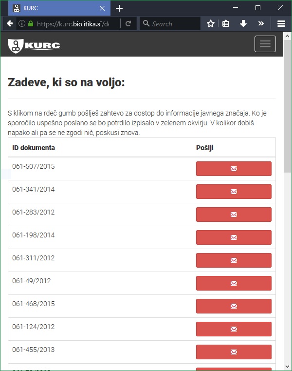

Application KURC is designed to send pre-designed e-mails to a specific e-mail. It uses Django framework.

E-mails are constructed from a list of documents and user expresses his or her will by pressing a button which sends an e-mail.
User logs in through Google account and needs to grant permission to read user's name, e-mail and grants permission to send
e-mails in her or his name.

All users can upload documents (limited to certain file types) which are accessible to all registered users.
To those with high enough privilege can access statistics of sent requests and uploaded documents.

Logo and frontend was designed using [Bootstrap](http://getbootstrap.com/) kudos to [wozzu](https://github.com/wozzu).

